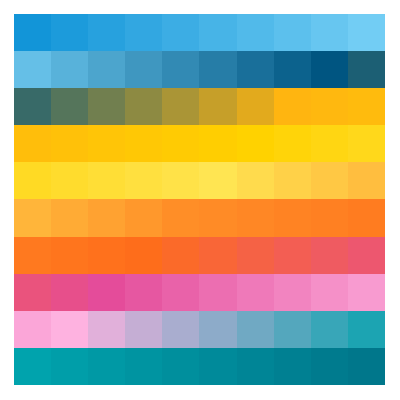
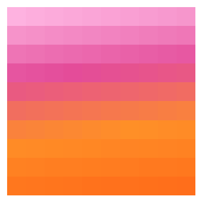
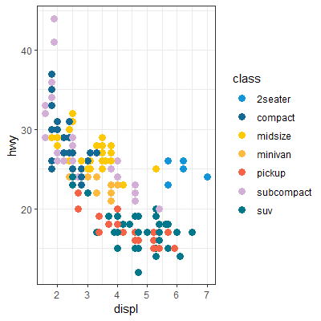
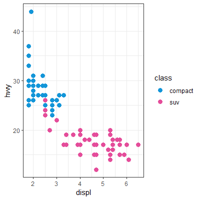

[](https://www.repostatus.org/#active)
[](commits/develop)
[](/commits/master)

# UC Inspired Colors for Coloring

An R package of colors inspired from incredible University of California color scheme. Following are some snippets and some use case. Mix and match as you feel innovative. Enjoy, be safe, and be kind. 

## Installation

``` r
# Install the development version from GitHub:
# install.packages("devtools")
  devtools::install_github("rohit43/UcColoR")
```

## Palettes

## Let there be light
```{r, eval = TRUE}
library(scales)
library(UcColoR)
mCol <- ucPal(palette = "Let there be light", reverse = FALSE)(100)
show_col(mCol, labels = FALSE, borders = NA)
```


## Sun Rise
```{r}
mCol <- ucPal(palette = "Sun Rise", reverse = TRUE)(100)
show_col(mCol, labels = FALSE, borders = NA)
```


## Left my Blues in San Francisco
```{r}
mCol <- ucPal(palette = "Left my Blues in SF", reverse = FALSE)(100)
show_col(mCol, labels = FALSE, borders = NA)
```


## Color me Gold
```{r}
mCol <- ucPal(palette = "Color me Gold", reverse = FALSE)(100)
show_col(mCol, labels = FALSE, borders = NA)
```


# Use with ggplot
```{r}
library(ggplot2)
ggplot(data = mpg) +
  geom_point(mapping = aes(displ, y = hwy, color = class), size = 3) +
  scale_color_ucCol(palette = "Let there be light") +
  theme_bw()
```


## Manual colors
```{r, message=FALSE}
library(dplyr)
mpg |>
  filter(class %in% c("compact", "suv")) |>
ggplot() +
  geom_point(mapping = aes(displ, y = hwy, color = class), size = 3) +
  scale_color_manual(values = c(ucColor()[[1]], ucColor()[[9]])) +
  theme_bw()
```

